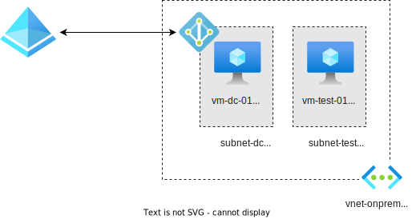

# Active Directory (AD) and Entra Connect

- [Setup](#setup)
  - [Domain Controller](#domain-controller)
  - [Install Entra Connect Sync](#install-entra-connect-sync)
  - [Add client VM to AD domain](#add-client-vm-to-ad-domain)
  - [Add user account](#add-user-account)
  - [Configure Entra Connect](#configure-entra-connect)
- [Note](#note)




- A vNet, two subnets
- Two VMs, one as Domain Controller(DC), another as a testing VM
- AD DS installed on the DC
- Entra Connect installed on the DC


## Setup

### Domain Controller

"Run as Administrator" on `vm-dc-01`

```powershell
# Variables
$DomainName = "guisheng.li"
$NetBIOSName = "GUISHENG"
$SafeModePassword = ConvertTo-SecureString "P@ssw0rd" -AsPlainText -Force

# Install AD Domain Services role
Install-WindowsFeature -Name AD-Domain-Services -IncludeManagementTools

# Promote the server to a Domain Controller
Install-ADDSForest `
    -DomainName $DomainName `
    -DomainNetbiosName $NetBIOSName `
    -SafeModeAdministratorPassword $SafeModePassword `
    -InstallDNS:$true `
    -Force:$true

# Restart the server after installation
Restart-Computer
```

After this, you local user/password becomes domain admin user/password

### Install Entra Connect Sync

- (Required) Enable TLS 1.2 on the DC machine, see https://learn.microsoft.com/en-us/entra/identity/hybrid/connect/reference-connect-tls-enforcement
- Download `AzureADConnect.msi` from Azure Portal
- Install on DC
- You need to provide two accounts during installation
  - For the Entra account, use a user with "Hybrid Identity Administrator" Entra role and with the `guisheng.li` domain
  - For the AD DS enterprise administrator account, use: `GUISHENG\gary` / <vm-password>

### Add client VM to AD domain

- Set vNet DNS to the private IP of DC (`10.1.0.4`), so it can resolve `guisheng.li`
  - The DNS server has already been configured using Azure Provided DNS (`168.63.129.16`) as forwarders (seems done automatically)
- Restart the VM so the DNS settings take effect
- Somehow the `Add-Computer` commands fails, GUI works
  - Go to "Local Server" -> "Workgroup" in Server Manager, change this VM to be a member of the `guisheng.li` domain
  - Restart the VM

### Add user account

- Add a user(eg. `Zhangfei OnPrem`) to AD
- On `vm-test-01`, configure "Remote Desktop" settings, allow `Zhangfei`
- Now you can RDP to `vm-test-01` with `Zhangfei`
- Now the user `Zhangfei` and `vm-test-01` should be synced to Entra

### Configure Entra Connect

Now you can run Entra Connect to test configurations:

- Sign-in options
- Seamless SSO
- Device hybrid join

  *`vm-test-01` is already registered after the initial syncing, is this step necessary ??*


## Note

- Can't RDP to VMs initially, successful after reset password ?