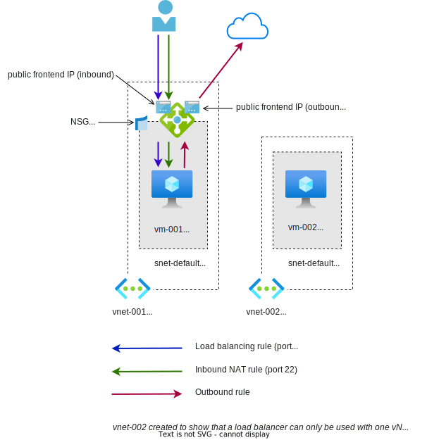

# README

Testing Azure Load Balancer

Resources:



- Two vNets, each has a subnet, one VM
  - VM NIC has two private IPs
  - Disable implicit outbound connectivity by setting `defaultOutboundAccess = false` on subnets
- One Standard load balancer
  - Two public frontend IPs, one for inbound, one for outbound
  - A backend pool, contains two IPs of the same VM
  - A load balancing rule (port 80) (NSG needs to allow port 80 traffic)
  - An inbound NAT rule (port 22, for SSH login) (NSG needs to allow port 22 traffic)
  - An outbound rule

## Testing

Since this VM doesn't have a public IP (or Bastion), there are two ways to run command in it:

1. Use "Run Command"

    ```
    az vm run-command invoke \
      -g rg-lb-demo-001 \
      -n vm-001 \
      --command-id RunShellScript \
      --scripts "<script>"
    ```

2. With an inbound NAT rule for SSH on the load balancer

    ```
    ssh -i ~/downloads/azure-test adminuser@<lb-public-ip>
    ```

To test outbound rule:

```sh
# use this to test your connectivity to the Internet and get your IP info
curl --max-time 3 ipinfo.io

# this should be successful and shows the outbound public IP of the load balancer
```

To test load balancing rule:

1. Login to the VM, add Nginx: `sudo apt install nginx`
2. Wait a little while, so the backend instance becomes healthy
3. Run this on localhost: `bash test-load-balancing-rule.sh`