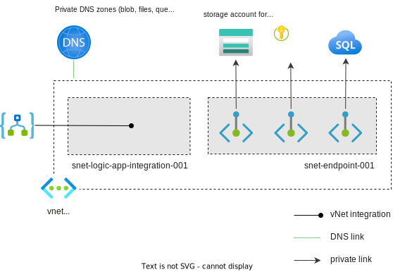

# Logic App accessing other resources

Test how logic app access other PaaS Services, which have public access disabled and private endpoints enabled

## Resources

- Logic app (consumption, multi-tenant)
- Logic app (standard, single-tenant)
- VNet for private endpoints
- Storage account with private endpoints for each sub service
- Key vault with a private endpoint
- SQL DB with private endpoint
  - Loaded with sample data: AdventureWorksLT
  - Myself set as Entra admin
  - Allow my public ip in the SQL firewall

## Test access to KV secret

### How

Create a workflow:
- A Request trigger
- A KV read secret action (Use the managed identity of the logic app for authentication)

### Results

- Logic app (consumption multi-tenant)
  - KV - Allow public access from all networks: Success
  - KV - Allow public access from specific virtual networks and IP addresses: Failure
  - KV - Allow public access from specific virtual networks and IP addresses - Logic app connector outgoing IPs allowed: Success
  - KV - Disable publice access: Failure

  - *Allow trusted Microsoft services to bypass this firewall* doesn't work for logic apps

- Logic app (standard single-tenant) with vNet integration, "Configuration routing - Content storage" must be enabled as well
  - KV - Allow public access from all networks: Success
  - KV - Disable publice access: Success

## Test access to SQL server

### How

Create a workflow:

- A Request trigger
- A SQL Get tables action (Use the managed identity of the logic app for authentication)

### Logic app (consumption multi-tenant)

- Add the logic app managed identity as a user in the SQL DB
- There's only a shared SQL connector, so you need to add the Connector outgoing IP addresses to the SQL server firewall
- Use the full FQDN in the SQL Get tables action

### Logic app (standard single-tenant)

- Add the standard logic app managed identity as a user in the SQL DB
- Use the full FQDN in the SQL Get tables action
- For stateless workflow:
  - Built-in connector: can access via private endpoint, SQL public network access could be disabled
  - Shared connector: can access via the public endpoint, need to allow the public outgoing IPs of the shared connectors in SQL firewall

- For stateful workflow:
  - Can use either built-in or shared connector, should be the same as stateless workflow