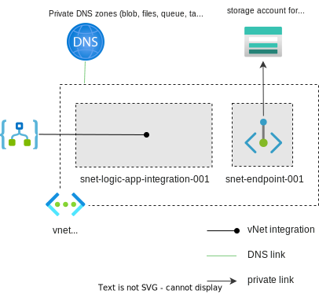

# Deploy Standard logic apps to private storage accounts

This is similar to [the other demo](../logic-app-access-kv-and-sql/), only difference is this one uses a private storage account to store the logic app data.

See Microsoft docs:

[Deploy Standard logic apps to private storage accounts - Azure Logic Apps | Microsoft Learn](https://learn.microsoft.com/en-us/azure/logic-apps/deploy-single-tenant-logic-apps-private-storage-account)

The document offers two options:
1. Enable public access to the storage account temporarily, then disable it
2. Use an ARM template (seems a bit outdated)

## Resources

- Logic app (standard, single-tenant)
- VNet for private endpoints
- Storage account with private endpoints for each sub service
  - This apps is used for storing logic app files, and for the testing
  - Logic App's managed identity has blob data reader role on the storage account

After you run Terraform apply, there's a few more manual steps to make it work:

1. Go to app settings of the new logic app, you'll see a variable for the file share name
2. Create the file share in the storage account
3. Remove the `WEBSITE_CONTENTOVERVNET` app settings, save
4. Go to the vNet integration page of the logic app, enable all the "Configuration routing" settings

## Test

1. Create a workflow (stateless or stateful)
2. Use a "Request" trigger
3. Add a "List all containers" action
   1. Create a connection to the storage account with system assigned managed identity of the logic app
4. Enable "debugging" on the workflow
5. Trigger with payload, the result page gives you a link to a monitoring page, click on the link, it should show the result of each step