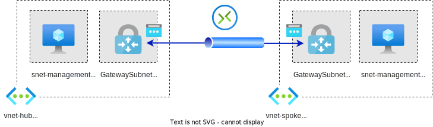

# VPN vNet-to-vNet connection

Adapted from https://github.com/Azure/terraform/blob/master/quickstart/301-hub-spoke, which has two spokes, an NVA in hub, a on-prem vNet



- Two vNets
- One VPN gateway in each vNet
  - We are using the "VNet-to-VNet" type connection, not the "Site-to-Site" type
- One public IP for each VPN gateway


## Testing

```sh
# login to spoke VM
ssh -i ~/downloads/azure-test adminuser@<spoke-vm-public-ip>

# test connection to hub-vm
ping 10.0.1.4
```